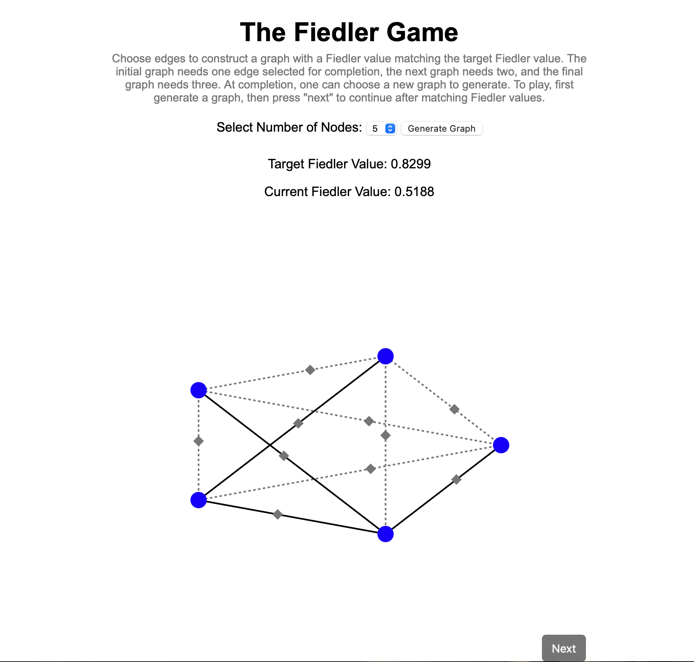

# Fiedler-Value-Graph-Exploration
This is an interactive setup to see how the addition of edges to a graph affects the Fiedler value. The game is constructed so that one must add edges to a graph to match the Fiedler value with a target value.

To run:
- $python app.py
- put "http://127.0.0.1:5000" in the browser

